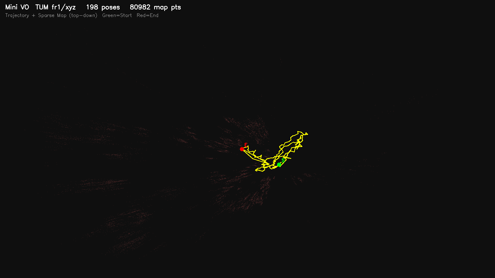
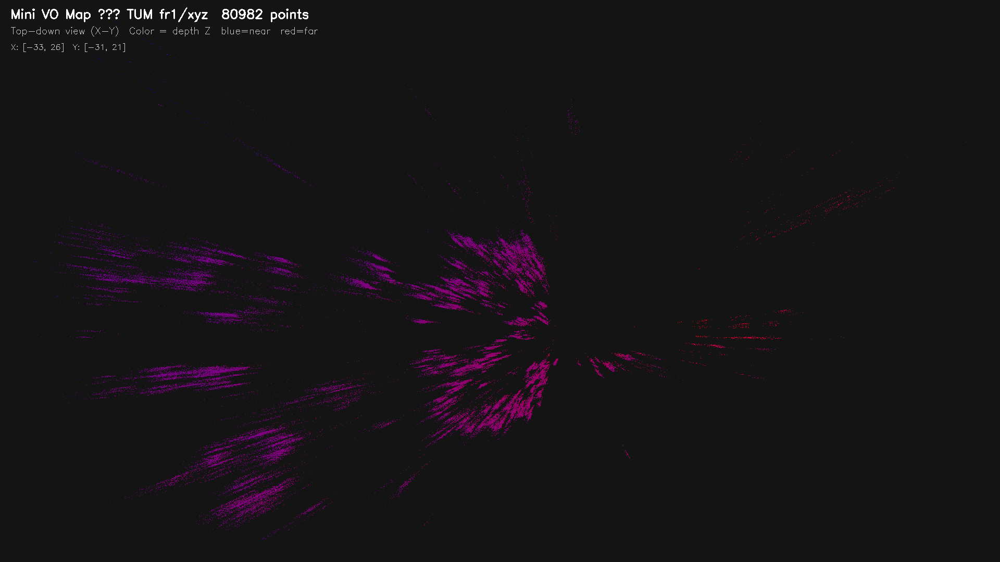
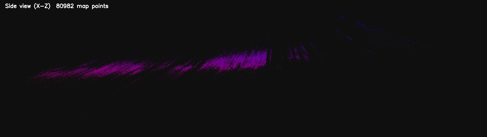

# Mini VO

从零构建的轻量级单目视觉里程计，仅依赖 OpenCV。

**Pipeline：** ORB 提取 → Ratio-test 匹配 → Essential Matrix 初始化 → **3D-2D PnP 跟踪** → 关键帧 + 视差角检查三角化 → TUM 轨迹 + PLY 地图输出。

## 运行结果 (TUM fr1/xyz, 200 frames)

| Metric     | Value  |
|------------|--------|
| Frames     | 198    |
| Map points | 80,992 |

### 轨迹 ／ 稀疏地图
| Trajectory | Map (top-down) | Map (side) |
|------------|---------------|------------|
|  |  |  |

> 3D 交互地图：浏览器打开 `results/map_3d.html`

详见 [docs/results.md](docs/results.md)

## 快速开始

```bash
mkdir build && cd build
cmake .. && make -j$(nproc)

# EuRoC
./vo_bin euroc /path/to/MH_01_easy/mav0/cam0/data 50

# TUM RGB-D
./vo_bin tum /path/to/rgbd_dataset_freiburg1_xyz 200
```

**输出：** `results/trajectory.txt` (TUM格式) + `results/map.ply` (点云，按深度着色)

## 项目结构

```
mini-vo/
├── include/mini_vo/    # 头文件
│   ├── types.h             # VOSystem、VOStatus
│   ├── initializer.h       # E 矩阵 + SVD + recoverPose + 三角化
│   ├── tracker.h           # 3D-2D PnP 跟踪 + 关键帧三角化
│   └── vo_system.h         # 状态机 + 轨迹/PLY 输出
├── src/
│   ├── initializer.cpp
│   ├── tracker.cpp
│   ├── vo_system.cpp
│   └── main.cpp            # CLI (euroc / tum)
├── config/euroc.yaml
├── docs/                   # 文档
├── results/                # 输出轨迹/点云/可视化
└── test/
```

## 算法流程

| 阶段         | 方法 |
|-------------|------|
| 特征提取     | ORB (2000 points) |
| 特征匹配     | BFMatcher + knn ratio test (0.8) |
| 初始化       | Essential Matrix (RANSAC) → SVD correction → recoverPose → DLT 三角化 |
| **帧间跟踪** | **3D-2D PnP** (solvePnPRansac)：当前帧描述子 → 全局地图描述子 → 收集 2D-3D 对应 → PnP 解位姿 |
| 关键帧三角化 | 每 5 帧 + 视差角检查 (cos < 0.999) + 自适应距离阈值 + 重投影误差 < 3.0px |
| 轨迹输出     | TUM 格式 + 四元数转换 |

## 状态机

```
UNINITIALIZED ──(2帧初始化成功)──▶ TRACKING
     ▲                               │
     │         (跟踪失败)              │
     └────────── LOST ◀───────────────┘
     │                               │
     └── (重初始化成功, 回TRACKING) ───┘
```

## 质量过滤

| 阶段 | 策略 |
|------|------|
| 匹配 | Ratio test (d1/d2 < 0.8) + RANSAC |
| 三角化 | 深度正值 + 视差角 (cos < 0.999) + 自适应距离 (中值×5, 下界×0.1) + 重投影 < 3.0px |
| PnP | solvePnPRansac, 置信度 0.99, 阈值 6.0px |

## 依赖

- OpenCV ≥ 4.x | CMake ≥ 3.16 | C++17

## 已知局限

- 单目尺度不确定性
- 无 Bundle Adjustment / 回环检测
- 运动模糊 / 弱纹理场景 ORB 退化
- 固定间隔关键帧（非自适应）

## 参考

- [ORB-SLAM](https://github.com/raulmur/ORB_SLAM)
- [TUM RGB-D Benchmark](https://cvg.cit.tum.de/data/datasets/rgbd-dataset)
- [EuRoC MAV Dataset](https://projects.asl.ethz.ch/datasets/doku.php?id=kmavvisualinertialdatasets)
