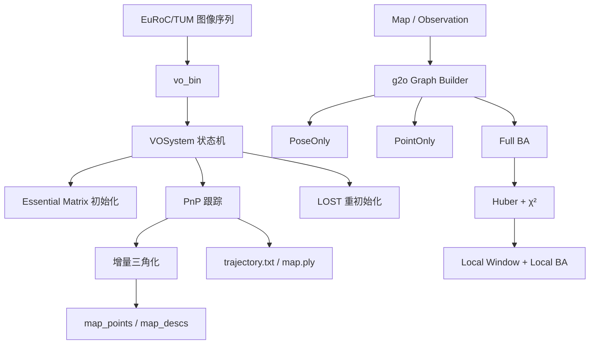

# Mini-VO

一个使用 C++17 构建的轻量级单目视觉里程计与 Bundle Adjustment 学习工程。

项目覆盖从图像输入到轨迹/地图输出的完整 VO 主链路，并提供结构化 `Map/Observation`、g2o 图构建、Pose-only BA、Point-only BA、联合 BA、鲁棒外点分类和 Local BA 后端。

> 完整架构、数据流、模块边界和排错说明见 [项目总览文档](docs/project_overview.md)。

## 当前状态

仓库包含两层实现：

1. **实时 VO 主链路**：双帧初始化、3D–2D PnP 跟踪、增量三角化、丢失重初始化、TUM 轨迹和 PLY 地图输出；
2. **结构化 BA 后端**：`Map/KeyFrame/MapPoint/Observation`、g2o、三种 BA、Huber/χ² 外点处理和 Local BA。

BA 后端已实现并通过自动测试，但尚未接入实时 `processFrame()`。当前 `vo_bin` 运行时主要使用 `VOSystem` 的扁平地图结构。

## 功能概览

- EuRoC 图像目录与 TUM `rgb.txt` 输入；
- ORB 特征提取与 BFMatcher ratio test；
- Essential Matrix + RANSAC 双帧初始化；
- `recoverPose()` 与 DLT 三角化；
- 3D–2D `solvePnPRansac()` 跟踪；
- 跟踪失败后的冻结关键帧重初始化；
- TUM 格式轨迹和 ASCII PLY 稀疏地图输出；
- 可选逐帧调试图像；
- 显式 `Map/Observation` 数据模型；
- 针孔相机、SE(3) 与重投影误差模块；
- Pose-only、Point-only 和联合 Bundle Adjustment；
- Huber 核、χ² 与正深度外点分类；
- 共视局部窗口和 Local BA；
- 14 项 CTest 自动测试。

## 系统架构



## 实时 VO 流程

### 1. UNINITIALIZED

```text
Frame 1 + Frame 2
  → ORB
  → BFMatcher + ratio test
  → Essential Matrix + RANSAC
  → SVD 修正
  → recoverPose
  → DLT 三角化
  → 正深度/距离/重投影过滤
  → 初始地图
```

第一帧只保存特征和单位位姿。第二帧开始尝试初始化；失败时滑动第一帧候选。

### 2. TRACKING

```text
Current frame
  → ORB
  → 当前描述子匹配 map_descs
  → 收集 2D–3D 对应
  → solvePnPRansac
  → 更新 Tcw
  → 保存轨迹
  → 三角化新地图点
```

### 3. LOST

PnP 失败后进入 `LOST`。系统冻结关键帧，等待当前帧与该关键帧形成足够基线，再尝试重新初始化。

## BA 后端

| 模块 | 接口 | 用途 |
|---|---|---|
| g2o 构图 | [`g2o_graph_builder.h`](include/mini_vo/backend/g2o_graph_builder.h) | 从 Map 创建顶点、边和 Observation 映射 |
| 位姿优化 | [`pose_optimizer.h`](include/mini_vo/backend/pose_optimizer.h) | 固定地图点，只优化一个 `Tcw` |
| 地图点优化 | [`point_optimizer.h`](include/mini_vo/backend/point_optimizer.h) | 固定位姿，只优化一个 `Pw` |
| 联合 BA | [`bundle_adjuster.h`](include/mini_vo/backend/bundle_adjuster.h) | 同时优化选中的关键帧和地图点 |
| 鲁棒策略 | [`robust_policy.h`](include/mini_vo/backend/robust_policy.h) | Huber、χ²、正深度和外点分类 |
| Local BA | [`local_bundle_adjuster.h`](include/mini_vo/backend/local_bundle_adjuster.h) | 选择共视窗口并执行局部联合 BA |

三种图模式：

| `GraphMode` | 位姿 | 地图点 | 典型场景 |
|---|---|---|---|
| `PoseOnly` | 优化 | 固定 | PnP 后位姿精修 |
| `PointOnly` | 固定 | 优化 | 多帧三角化点精修 |
| `FullBundleAdjustment` | 按策略固定或优化 | 优化 | 联合 BA / Local BA |

## χ² 与鲁棒外点

二维重投影残差：

$$
\mathbf e =
\begin{bmatrix}
u_{obs}-u_{pred} \\
v_{obs}-v_{pred}
\end{bmatrix}
$$

加权平方误差：

$$
\chi^2=\mathbf e^T\Omega\mathbf e
$$

默认参数：

| 参数 | 默认值 | 用途 |
|---|---:|---|
| `chi2_threshold` | `5.991` | 二维残差 95% 卡方阈值 |
| `huber_delta` | `2.447651936` | $\sqrt{5.991}$，Huber 范数切换点 |

鲁棒联合 BA 先带 Huber 核短预优化，再按 χ² 和正深度分类，把外点设为 `level=1`，移除鲁棒核后仅使用内点完成最终优化。

## 目录结构

```text
mini-vo/
├── apps/                         # 独立学习程序
├── config/                       # 相机配置示例
├── docs/                         # 项目总览、pipeline、结果
├── include/mini_vo/
│   ├── initializer.h
│   ├── tracker.h
│   ├── vo_system.h
│   ├── camera/                   # 针孔相机
│   ├── core/                     # Map、Observation、SE(3)
│   └── backend/                  # g2o、BA、Local BA
├── scripts/                      # 运行与轨迹转换工具
├── src/
│   ├── main.cpp                  # CLI 入口
│   ├── initializer.cpp
│   ├── tracker.cpp
│   ├── vo_system.cpp
│   ├── camera/
│   ├── core/
│   └── backend/
└── test/                         # 14 个测试
```

## 依赖

- CMake ≥ 3.16
- C++17 编译器
- OpenCV ≥ 4.x
- Eigen3
- Sophus
- g2o：`core`、`types_sba`、`solver_dense`

## 构建

在 WSL 中执行：

```bash
cd /home/slamdev/workspace/mini-vo

CMAKE_PREFIX_PATH=$HOME/workspace/deps/sophus:$HOME/workspace/deps/g2o \
  cmake -S . -B build -DBUILD_TESTS=ON

cmake --build build -j4
```

主要构建目标：

| Target | 用途 |
|---|---|
| `mini_vo` | 静态核心库 |
| `vo_bin` | 数据集运行入口 |
| `day35_gauss_newton` | 独立高斯牛顿实验 |
| `test_*` | 自动测试 |

## 运行

### EuRoC

```bash
./build/vo_bin euroc /path/to/MH_01_easy/mav0/cam0/data 200
```

程序从目录读取并排序 `.png/.jpg/.jpeg`。

### TUM

```bash
./build/vo_bin tum /path/to/rgbd_dataset_freiburg1_xyz 200
```

程序读取数据集目录下的 `rgb.txt` 并保留真实时间戳。

### 调试可视化

```bash
./build/vo_bin tum /path/to/dataset 200 --viz
```

调试图片输出到 `debug/`。

## 输出

| 文件 | 内容 |
|---|---|
| `trajectory.txt` | TUM 格式时间戳、平移、四元数 |
| `map.ply` | 按深度着色的 ASCII PLY 稀疏地图 |
| `debug/*.png` | ORB、初始化、PnP 内点和 LOST 状态图 |

已有运行结果见 [docs/results.md](docs/results.md)。

## 测试

```bash
ctest --test-dir build --output-on-failure
```

当前共 14 项：

| 层次 | 测试 |
|---|---|
| 前端 | `test_initializer`, `test_tracker` |
| 数据模型 | `test_observation`, `test_map` |
| 几何 | `test_camera`, `test_reprojection_error`, `test_se3_utils` |
| g2o | `test_g2o_graph_builder` |
| 单变量 BA | `test_pose_optimizer`, `test_point_optimizer` |
| 鲁棒联合 BA | `test_robust_policy`, `test_bundle_adjuster` |
| Local BA | `test_local_window_selector`, `test_local_bundle_adjuster` |

## 当前限制

- 实时 `VOSystem` 与结构化 `Map` 尚未统一，BA 后端未接入 `processFrame()`；
- `config/euroc.yaml` 尚未被 `vo_bin` 读取，EuRoC/TUM 内参仍硬编码在 `main.cpp`；
- 单目系统没有外部尺度源；
- 尚无回环检测、Sim(3) 验证和位姿图优化；
- 实时地图维护仍缺少关键帧剔除、地图点融合和长期可见性统计；
- 关键帧/三角化策略仍较基础。

## 文档

- [完整项目总览](docs/project_overview.md)
- [VO Pipeline](docs/pipeline.md)
- [数据集结果](docs/results.md)

## License

[MIT](LICENSE)
